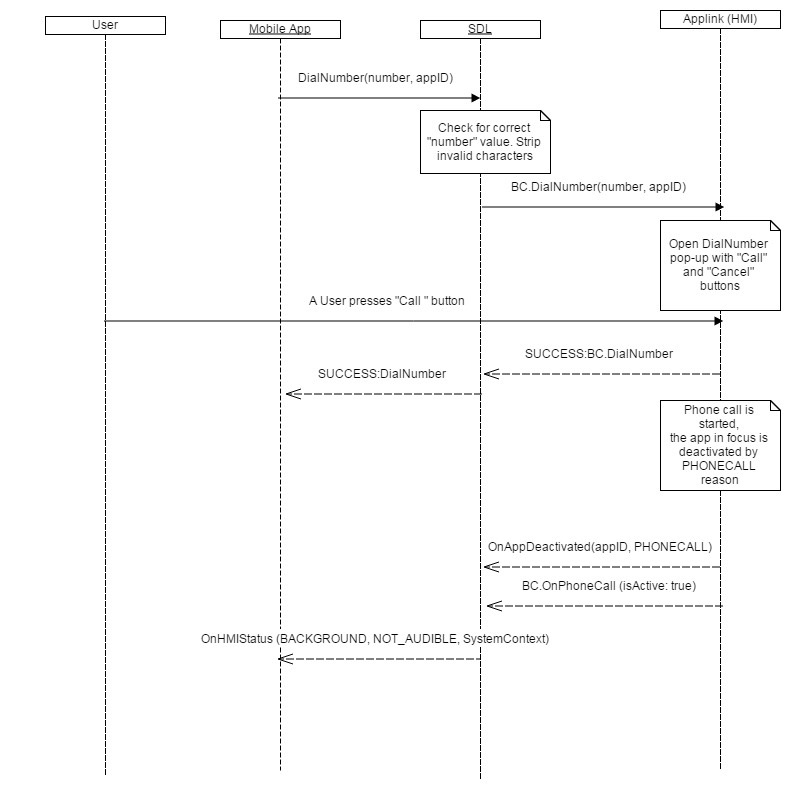
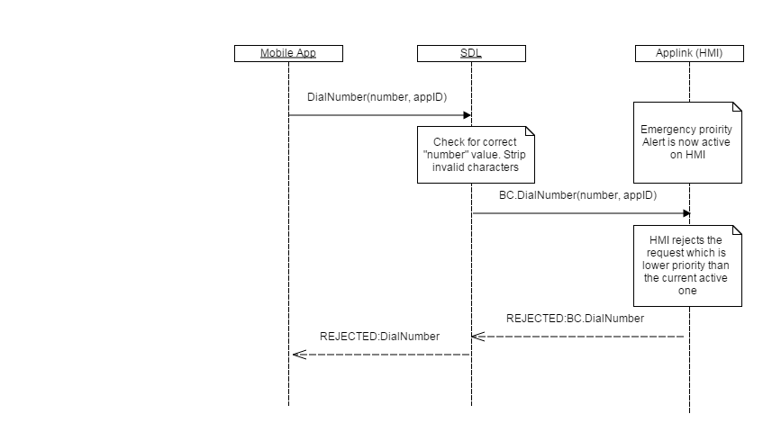

## DialNumber

Type
: Function

Sender
: SDL

Purpose
: SDL initiates a call to a specific phone number.

### Request

#### Parameters

|Name|Type|Mandatory|Additional|Description|
|:---|:---|:--------|:---------|:----------|
|number|String|true|maxlength: 40|The number to dial. All characters will be stripped except for digits 0-9 and * # , ; +
|
|appID|Integer|true||ID of application that initiates the call|

!!! NOTE

SDL looks to see if the phone number entered is correct before passing to the HMI. The checks performed are:

  1. Strip any characters except of 0-9 and * # , ;+ and pass resulting number to HMI.
  2. Return INVALID_DATA to mobile side without transferring "number" to the HMI if "number" is empty after stripping invalid characters.
  3. Return INVALID_DATA to mobile side without transferring "number" to HMI if the characters "/n" , "/t", or spaces are included in "number".

!!!

!!! MUST

  1. Show DialNumber pop-up on HMI with 2 buttons, "Call" and "Cancel".
  2. Send the notification OnAppDeactivated(PHONECALL) to SDL when the phone call is started on the HMI. The notification must be sent to all applications that have active audio sources on the HMI.
  3. Send the notification BC.OnOnPhoneCall(isActive:true) to SDL when the phone call is started on the HMI.
  3. Send the notification BC.OnOnPhoneCall(isActive:false) to SDL when the phone call is ended on the HMI.
  4. Always respond to BC.DialNumber with a response code. If the HMI does not respond, the mobile application will never get a response from from SDL because default timeouts do not apply to the DailNumber mobile API.

!!!

The request is considered to have been executed successfully only after the user presses the "Call" button included in the DialNumber dialog.

### Response

#### Parameters

This RPC has no additional parameter requirements

### Sequence Diagrams
|||
DialNumber Success

|||
|||
|||
DialNumber Failed

|||

### Example Request

```json
{
	"id" : 59,
	"jsonrpc" : "2.0",
	"method" : "BasicCommunication. DialNumber",
	"params" :
	{
				"number" : "*111#",
				"appID" : 65537
	}
}
```
### Example Response

```json
{
	"id" : 59,
	"jsonrpc" : "2.0",
	"result" :
	{
		"code" : 0,
		"method" : "BasicCommunication.DialNumber"
	}
}
```

### Example Error

```json
{
	"id" : 59,
	"jsonrpc" : "2.0",
	"error" :
	{
		"code" : 5,
		"message" : " HMI is busy with higher priority RPC ",
		"data" :
		{
			"method" : "BasicCommunication.DialNumber"
		}
	}
}
```
