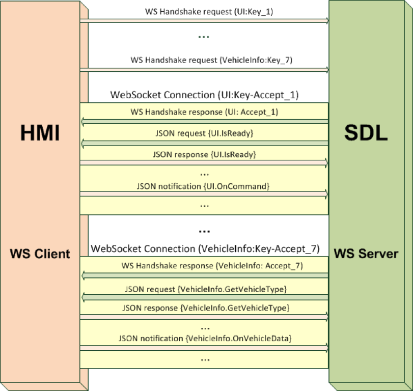
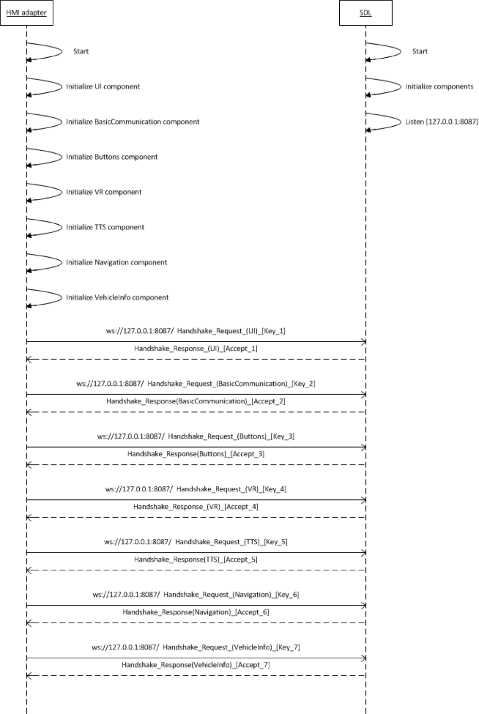

# Connecting to SDL
## Requirements to HMI Adapter
WebSocket is the primary means of communicating with the SDL component from the vehicle. In a basic example, an HTML5 HMI would use a native WebSocket library to communicate with SDL Core.

The HMI Adapter must:

!!! must
  * be installed on the same vehicle HU OS where SDL is installed, or the HMI must be able to be networked to SDL and address it via a static IP address.
  * create and initialize components which are defined in the HMI_API specification for the version of SDL which is running on the vehicle HU. (BasicCommunication, UI, Buttons, VR, TTS, Navigation, VehicleInfo)
  * Establish a separate WebSocket connection with SDL for each of components defined in the HMI_API specification.
  * Use the appropriate corresponding connection when sending responses and notifications to any connected component.

!!!

## Handshake
For opening a WebSocket connection, a handshake must be performed.

!!! info
  1. Client/Server relationship
    * SDL is the Server
    * The HMI is the Client
  2. Host
    * SDL is listening on 127.0.0.1:8087
  3. WebSocket Protocol Version 13 is used by SDL

!!!

## HMI Component Registration
Once all the requested connections are opened, the HMI must send the JSON request for registering each component TODO: (see section 4.2 for JSON format details and Example #4 for registration example).

Component Registration has the following unique request requirements

| Key     | Value Info    |
| :------------- | :------------- |
| "id"       | a multiple of 100 (100, 200, 300, ..., 700) |
| "jsonrpc" | "2.0" - constant for all messages between SDL and the HMI|
| "method" | "MB.registerComponent" - the request is assigned to SDL's MessageBroker where the component name will be associated with the socket ID. Further, SDL will send messages related to the named component over the corresponding connection|
|"componentName"| The name of the component being registered. Must correspond to the appropriate component name described in the current guidelines.|

SDL Provides a JSON Response

| Key | Value Info   |
| :------------- | :------------- |
| "id"      | The value from the corresponding request      |
| "result" | Value of id multiplied by 10. HMI can treat this as a successful registration|

### Component Registration Examples

#### Register Component JSON Messages
##### Request
``` json
{
  "id": 700,
  "jsonrpc": "2.0",
  "method": "MB.registerComponent",
  "params": {
    "componentName": "VehicleInfo"
  }
}
```
##### Response
``` json
{
  "id": 700,
  "jsonrpc": "2.0",
  "result": 7000
}
```


#### WebSocket Connection Diagram


#### HMI Adapter Initialization

